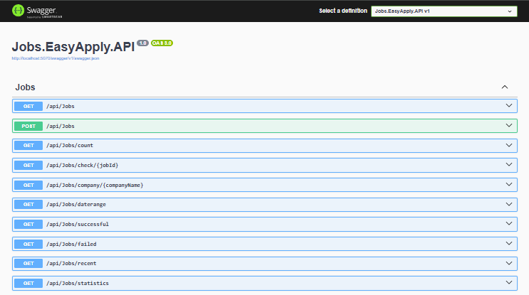

# LinkedIn Jobs Easy Apply Automation

A sophisticated .NET application that automates the process of searching for and applying to jobs on LinkedIn using Selenium WebDriver. The application features a clean architecture, comprehensive configuration system, and robust error handling.

## 🚀 Features

- **Automated Job Search**: Searches LinkedIn for jobs based on configurable parameters
- **Easy Apply Automation**: Automatically applies to jobs with LinkedIn's "Easy Apply" feature
- **Enhanced Contact Form Detection**: Intelligently detects and handles pre-filled contact information forms
- **Smart Form Field Analysis**: Automatically identifies when forms are complete vs requiring manual input
- **Duplicate Prevention**: Tracks applied jobs to avoid re-applying
- **Configurable Search Parameters**: Customizable job titles, locations, and credentials
- **Comprehensive Logging**: Detailed logging using Serilog for monitoring and debugging
- **Database Integration**: SQLite database for tracking application history
- **Clean Architecture**: Well-organized code structure following .NET best practices
- **REST API**: Provides endpoints to retrieve applied jobs and job count
- **Swagger UI**: Interactive API documentation and testing interface

## 🔍 Enhanced Contact Form Detection

The application includes advanced form field detection that intelligently handles LinkedIn's contact information forms:

### How It Works
- **Automatic Detection**: Identifies when a form is LinkedIn's standard contact information form
- **Pre-filled Recognition**: Detects when fields are already populated with your LinkedIn profile data
- **Smart Analysis**: Uses multiple detection strategies to ensure accurate field completion assessment
- **Seamless Continuation**: Automatically proceeds when forms are complete, only pausing for actual additional questions

### Benefits
- **Reduced Manual Intervention**: No need to manually fill contact forms that are already complete
- **Faster Processing**: Significantly speeds up the job application process
- **Better User Experience**: Only pauses when truly necessary (for custom questions)
- **Reliable Detection**: Uses comprehensive field analysis to avoid false positives

### Technical Implementation
- **Multiple Selectors**: Employs various CSS selectors and detection strategies
- **Field Value Analysis**: Checks multiple sources for field values (value, text, innerText, innerHTML)
- **LinkedIn-Specific Logic**: Handles LinkedIn's unique form behaviors and placeholder patterns
- **Debugging Support**: Provides detailed console output for troubleshooting form detection issues

## 🌐 API Documentation

The application includes a REST API for retrieving job application data. The API is built using ASP.NET Core and provides the following endpoints:

### Endpoints

- **GET /api/Jobs**: Retrieves all applied jobs
- **GET /api/Jobs/count**: Retrieves the count of applied jobs

### API Screenshot



The Swagger UI provides an interactive interface for testing the API endpoints. You can access it at `http://localhost:5070/swagger/index.html` when the API is running.

## 🏗️ Architecture & Structure

The project follows a clean architecture pattern with multiple .NET projects organized into logical layers. This structure promotes separation of concerns, maintainability, and scalability.

```
📁 JobEasyApplicator/
├── 📁 Jobs.EasyApply.API/          # REST API for retrieving application data
│   ├── 📁 Controllers/             # API controllers
│   │   └── JobsController.cs       # Endpoints for jobs and statistics
│   ├── 📁 DTOs/                    # Data Transfer Objects
│   │   └── JobDTO.cs               # DTO for job data
│   ├── 📁 Middleware/              # Custom middleware (if any)
│   ├── 📁 Properties/              # Project properties and launch settings
│   ├── appsettings.json            # API configuration
│   ├── Program.cs                  # API entry point
│   └── Jobs.EasyApply.API.csproj   # Project file
├── 📁 Jobs.EasyApply.Common/       # Shared models and configurations
│   ├── 📁 Models/                  # Common data models
│   │   ├── AppliedJob.cs           # Entity for tracking applied jobs
│   │   ├── JobListing.cs           # Model for job listings
│   │   ├── AppSettings.cs          # Application settings
│   │   └── ApplicationStats.cs     # Statistics model
│   └── Jobs.EasyApply.Common.csproj # Project file
├── 📁 Jobs.EasyApply.Infrastructure/ # Data access and infrastructure services
│   ├── 📁 Data/                    # Database context and files
│   │   ├── JobDbContext.cs         # Entity Framework database context
│   │   └── appliedJobs.db          # SQLite database file
│   ├── 📁 Repositories/            # Repository pattern implementations
│   │   ├── IJobApplicationRepository.cs # Repository interface
│   │   ├── JobApplicationRepository.cs # Repository implementation
│   │   ├── IRepository.cs          # Base repository interface
│   │   ├── Repository.cs           # Base repository implementation
│   │   ├── IUnitOfWork.cs          # Unit of work interface
│   │   ├── UnitOfWork.cs           # Unit of work implementation
│   │   └── Specifications/         # Query specifications
│   │       ├── BaseSpecification.cs
│   │       ├── ISpecification.cs
│   │       └── JobApplicationSpecifications.cs
│   ├── 📁 Services/                # Infrastructure services
│   │   ├── IJobApplicationService.cs # Service interface
│   │   └── JobApplicationService.cs # Service implementation
│   └── Jobs.EasyApply.Infrastructure.csproj # Project file
├── 📁 Jobs.EasyApply.LinkedIn/     # Main console application for job automation
│   ├── 📁 Services/                # Core business logic services
│   │   ├── JobApplicator.cs        # Handles the job application process
│   │   └── JobScraper.cs           # Manages job searching and scraping
│   ├── 📁 Utilities/               # Utility classes for web interactions
│   │   └── HtmlScraper.cs          # HTML parsing and element interaction utilities
│   ├── Program.cs                  # Application entry point
│   └── Jobs.EasyApply.LinkedIn.csproj # Project file
├── README.md                       # This documentation file
├── ROADMAP.md                      # Project roadmap
├── swagger-screenshot.png         # API screenshot
├── .gitignore                      # Git ignore rules
└── Jobs.EasyApply.sln              # Visual Studio solution file
```

### Project Structure Details

#### **Jobs.EasyApply.LinkedIn (Main Application)**
- **Purpose**: Console application that orchestrates the job search and application process
- **Key Components**:
  - `Program.cs`: Application entry point with configuration loading and dependency injection setup
  - `JobScraper.cs`: Handles LinkedIn job searching, pagination, and job listing extraction
  - `JobApplicator.cs`: Manages the job application workflow and form interactions
- **Responsibilities**: Web scraping, form automation, error handling, and API communication

#### **Jobs.EasyApply.API (REST API)**
- **Purpose**: Provides HTTP endpoints for retrieving job application data and statistics
- **Key Components**:
  - `JobsController.cs`: REST endpoints for job data retrieval
  - `JobDTO.cs`: Data transfer objects for API responses
  - `Program.cs`: API startup configuration with Swagger integration
- **Responsibilities**: Data exposure, API documentation, CORS configuration

#### **Jobs.EasyApply.Common (Shared Models)**
- **Purpose**: Contains shared entities, models, and configuration classes
- **Key Components**:
  - `AppliedJob.cs`: Entity model for tracking job applications
  - `JobListing.cs`: Model representing job opportunities
  - `AppSettings.cs`: Configuration model for application settings
  - `ApplicationStats.cs`: Statistics and metrics model
- **Responsibilities**: Data contracts, shared types, configuration models

#### **Jobs.EasyApply.Infrastructure (Data Access)**
- **Purpose**: Handles data persistence, repository implementations, and external services
- **Key Components**:
  - `JobDbContext.cs`: Entity Framework Core database context
  - Repository implementations with Unit of Work pattern
  - Specification pattern for complex queries
  - Service layer for business logic
- **Responsibilities**: Database operations, data persistence, query specifications

#### **Jobs.EasyApply.Utilities (Web Interaction)**
- **Purpose**: Specialized utilities for web scraping and HTML parsing
- **Key Components**:
  - `HtmlScraper.cs`: Advanced HTML parsing with intelligent form detection
  - Enhanced contact form analysis and field completion detection
  - Multiple selector strategies for robust element finding
- **Responsibilities**: DOM manipulation, form field analysis, LinkedIn-specific parsing

### Architecture Principles

- **Layered Architecture**: Organized into distinct layers (Presentation, Business Logic, Data Access) for better separation of concerns
- **Dependency Injection**: Services are loosely coupled and easily testable using .NET's built-in DI container
- **Repository Pattern**: Abstracts data access logic for better maintainability
- **SOLID Principles**: Code adheres to Single Responsibility, Open/Closed, Liskov Substitution, Interface Segregation, and Dependency Inversion principles
- **Clean Code**: Emphasis on readability, modularity, and adherence to .NET best practices

## 📐 Design Patterns

The application implements several key design patterns to ensure maintainability, scalability, and adherence to best practices:

### Repository Pattern
- **Purpose**: Abstracts data access logic and provides a uniform interface for accessing data from different sources.
- **Implementation**: Located in `Jobs.EasyApply.Infrastructure/Repositories/`, with interfaces like `IJobApplicationRepository` and implementations like `JobApplicationRepository`.
- **Benefits**: Decouples business logic from data storage, making it easier to test and switch databases.

### Unit of Work Pattern
- **Purpose**: Maintains a list of objects affected by a business transaction and coordinates the writing out of changes.
- **Implementation**: `IUnitOfWork` and `UnitOfWork` classes in the Repositories folder, used to manage database transactions and ensure data consistency.
- **Benefits**: Ensures atomic operations and improves performance by batching database calls.

### Specification Pattern
- **Purpose**: Encapsulates query logic in reusable specifications for filtering and querying data.
- **Implementation**: `BaseSpecification`, `ISpecification`, and `JobApplicationSpecifications` in `Jobs.EasyApply.Infrastructure/Repositories/Specifications/`.
- **Benefits**: Keeps query logic separate from business logic, making queries more composable and testable.

### Dependency Injection (DI) Pattern
- **Purpose**: Manages object creation and lifetime, promoting loose coupling between classes.
- **Implementation**: Used throughout the application via .NET's built-in DI container, with services registered in `Program.cs` files.
- **Benefits**: Improves testability, maintainability, and allows for easy swapping of implementations.

### Clean Architecture Pattern
- **Purpose**: Organizes code into layers with clear dependencies, ensuring the core business logic is independent of external concerns.
- **Implementation**: Structured into Common (entities), Infrastructure (data access), API (presentation), and main application layers.
- **Benefits**: Makes the application easier to maintain, test, and evolve over time.

### Additional Patterns
- **Factory Pattern**: Used implicitly in service creation and configuration binding for creating objects without specifying exact classes.
- **Observer Pattern**: Applied in logging (e.g., Serilog sinks) to monitor and react to application events.
- **Strategy Pattern**: Potentially used in job application strategies, allowing different approaches for various job types or platforms.

These patterns work together to create a robust, flexible, and maintainable codebase that follows industry best practices.

## 🛠️ Technologies Used

### Core Technologies
- **.NET 9.0**: Modern .NET runtime with performance optimizations
- **C#**: Primary programming language
- **ASP.NET Core**: Framework foundation

### Web Automation
- **Selenium WebDriver**: Browser automation for LinkedIn interaction
- **ChromeDriver**: WebDriver implementation for Chrome browser
- **OpenQA.Selenium**: .NET bindings for Selenium

### Data & Storage
- **Entity Framework Core**: Object-relational mapping (ORM)
- **SQLite**: Lightweight embedded database
- **Microsoft.Data.Sqlite**: SQLite provider for Entity Framework

### Configuration & Settings
- **Microsoft.Extensions.Configuration**: Configuration management
- **Microsoft.Extensions.Configuration.Json**: JSON configuration provider
- **Microsoft.Extensions.Configuration.Binder**: Type-safe configuration binding

### Logging & Monitoring
- **Serilog**: Structured logging framework
- **Serilog.Sinks.Console**: Console output for logs

### Additional Dependencies
- **Microsoft.Extensions.DependencyInjection**: Dependency injection container
- **Microsoft.Extensions.Logging**: Logging abstractions
- **Microsoft.Extensions.Options**: Configuration options pattern

## ⚙️ Configuration

The application uses `appsettings.json` for all configuration. Here's a detailed breakdown:

```json
{
  "Credentials": {
    "Email": "your-linkedin-email@example.com",
    "Password": "your-linkedin-password"
  },
  "JobSearchParams": {
    "Title": ".NET Developer",
    "Location": "Remote",
    "ExperienceLevel": "Mid-Senior level",
    "JobType": "Full-time",
    "DatePosted": "Past Month",
    "EasyApplyOnly": true,
    "MaxJobsToApply": 50
  }
}
```

### Configuration Sections

#### Credentials
- **Email**: Your LinkedIn login email address
- **Password**: Your LinkedIn password (⚠️ Consider using environment variables for production)

#### JobSearchParams
- **Title**: Default job title to search for (can be overridden via command line)
- **Location**: Default job location to search in (can be overridden via command line)

### Configuration Best Practices

1. **Never commit passwords** to version control
2. **Use environment variables** for sensitive data in production
3. **Validate configuration** on application startup
4. **Provide sensible defaults** for optional parameters

## 📋 Parameters & Usage

### Command Line Arguments

The application accepts optional command line arguments to override default search parameters:

```bash
# Use default values from appsettings.json
dotnet run

# Override job title only
dotnet run "Senior Developer"

# Override both job title and location
dotnet run "Full Stack Developer" "Remote"
dotnet run "Full Stack Developer" "New York"

# Override location only (use empty string for title to use default)
dotnet run "" "San Francisco"
```

### Parameter Priority

1. **Command line arguments** (highest priority)
2. **Configuration file** (`appsettings.json`)
3. **Compiled defaults** (lowest priority)

## 🚀 Getting Started

### Prerequisites

- **.NET 9.0 SDK** or later
- **Chrome Browser** (for Selenium WebDriver)
- **LinkedIn Account** with valid credentials

### Installation

1. **Clone the repository**:
   ```bash
   git clone <repository-url>
   cd LinkedIn.Jobs.EasyApply
   ```

2. **Restore dependencies**:
   ```bash
   dotnet restore
   ```

3. **Configure credentials** in `appsettings.json`:
   ```json
   {
     "Credentials": {
       "Email": "your-linkedin-email@example.com",
       "Password": "your-linkedin-password"
     }
   }
   ```

4. **Build the application**:
   ```bash
   dotnet build
   ```

### Running the Application

#### Basic Usage
```bash
# Search for .NET Developer jobs in Remote (using config defaults)
dotnet run

# Search for specific job title
dotnet run "Python Developer"

# Search with custom location
dotnet run "React Developer" "Austin, TX"
```

#### Advanced Usage
```bash
# Build for production
dotnet publish -c Release

# Run published version
./bin/Release/net9.0/publish/LinkedIn.Jobs.EasyApply
```

## 📊 Application Flow

1. **Configuration Loading**: Load settings from `appsettings.json`
2. **Database Initialization**: Ensure SQLite database exists and is properly configured
3. **WebDriver Setup**: Initialize Chrome WebDriver with appropriate options
4. **LinkedIn Authentication**: Automated login using provided credentials
5. **Job Search**: Navigate to LinkedIn jobs search with specified parameters
6. **Job Processing**: For each job found:
   - Check if previously applied (skip if yes)
   - Navigate to job details page
   - Apply using Easy Apply feature if available
   - Record application result in database
7. **Cleanup**: Close browser and log completion

## 🔒 Security Considerations

- **Credential Management**: Store credentials securely, consider using:
  - Environment variables for production
  - .NET User Secrets for development
  - Azure Key Vault or similar for enterprise deployments
- **Browser Security**: Runs in non-headless mode for manual verification
- **Rate Limiting**: Includes delays to avoid detection as a bot

## 📝 Logging

The application uses Serilog for comprehensive logging:

- **Information**: General application flow and progress
- **Warning**: Non-critical issues (missing elements, skipped jobs)
- **Error**: Failed operations and exceptions
- **Debug**: Detailed troubleshooting information (when enabled)

Logs are output to the console by default and can be configured to write to files or external systems.

## 🗄️ Database Schema

The application uses SQLite as its database, managed through Entity Framework Core. The database is automatically created and migrated when the application runs.

### AppliedJob Table

The main table that tracks all job applications submitted through the system.

| Field | Type | Description | Constraints |
|-------|------|-------------|-------------|
| **Id** | INTEGER | Primary key | Auto-generated, Primary Key |
| **JobTitle** | TEXT | Title of the applied job | Required, Not Null |
| **Company** | TEXT | Name of the company | Required, Not Null |
| **JobId** | TEXT | Unique identifier from the job platform | Required, Not Null, Unique |
| **Url** | TEXT | URL of the job posting | Required, Not Null |
| **AppliedDate** | TEXT | Date and time when the application was submitted | Required, Not Null |
| **Success** | INTEGER | Whether the application was successful | Boolean (0/1), Not Null |

### Database Configuration

- **Database Engine**: SQLite 3
- **Connection**: File-based database stored in `Jobs.EasyApply.Infrastructure/Data/appliedJobs.db`
- **ORM**: Entity Framework Core with Code-First approach
- **Migrations**: Automatic schema creation and updates

### Data Relationships

Currently, the database consists of a single table (`AppliedJobs`) with no foreign key relationships. Future expansions may include:

- **JobPlatforms** table for multi-platform support
- **UserProfiles** table for user management
- **ApplicationLogs** table for detailed tracking
- **Skills** table for skills extraction and matching

### Database Operations

The application supports the following database operations through the repository pattern:

- **Create**: Add new job applications
- **Read**: Retrieve all applications or filter by criteria
- **Update**: Modify existing application records
- **Delete**: Remove application records (not currently implemented)

### Backup and Migration

- **Automatic Backups**: The application can be configured to create periodic backups
- **Migration Strategy**: Entity Framework handles schema changes automatically
- **Data Integrity**: Foreign key constraints and data validation ensure consistency

## 🚨 Troubleshooting

### Common Issues

1. **ChromeDriver not found**: Ensure Chrome browser is installed
2. **LinkedIn login fails**: Verify credentials in `appsettings.json`
3. **No jobs found**: Check search parameters and LinkedIn filters
4. **Element not found**: LinkedIn may have updated their HTML structure
5. **Contact form detection issues**: The application may incorrectly pause for manual input on pre-filled forms

### Enhanced Contact Form Detection Issues

If the application incorrectly pauses for manual input on contact forms that appear to be pre-filled:

1. **Check Console Output**: Look for debug messages showing field detection status:
   ```
   Email field detected as filled using selector: input[required]
   No phone field found, assuming not required
   Contact fields status - Email: True, Phone: True, Country: True
   ```

2. **Verify Field Detection**: The application should automatically detect when contact forms are complete and continue without manual intervention

3. **Update Detection Logic**: If LinkedIn changes their form structure, the detection selectors may need updating in `HtmlScraper.cs`

### Debug Mode

Enable detailed logging by modifying the logging configuration:
```csharp
Log.Logger = new LoggerConfiguration()
    .MinimumLevel.Debug()  // Change from Information to Debug
    .WriteTo.Console()
    .CreateLogger();
```

### Recent Improvements

#### Enhanced Contact Form Detection (Latest)
- **Issue**: Application incorrectly paused for manual input on pre-filled LinkedIn contact forms
- **Solution**: Implemented comprehensive form field detection with multiple selector strategies
- **Result**: Application now automatically detects and handles pre-filled contact information
- **Files Modified**: `Jobs.EasyApply.LinkedIn/Utilities/HtmlScraper.cs`
- **Benefits**: Faster processing, reduced manual intervention, better user experience

## 🤝 Contributing

1. Fork the repository
2. Create a feature branch
3. Make your changes
4. Add tests if applicable
5. Submit a pull request

## 📄 License

This project is licensed under the MIT License - see the LICENSE file for details.

## 🆘 Support

For support and questions:
- Create an issue in the repository
- Check existing issues for similar problems
- Review the troubleshooting section above

---

**Note**: This tool is for educational and personal use only. Ensure compliance with LinkedIn's Terms of Service and use responsibly.
