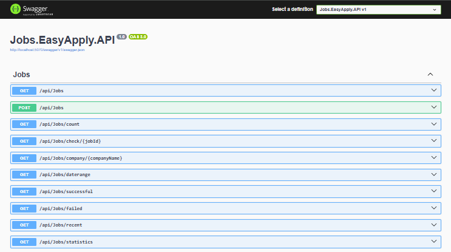

# LinkedIn Jobs Easy Apply Automation

A sophisticated .NET application that automates the process of searching for and applying to jobs on LinkedIn using Selenium WebDriver. The application features a clean architecture, comprehensive configuration system, and robust error handling.

## 🚀 Features

- **Automated Job Search**: Searches LinkedIn for jobs based on configurable parameters
- **Easy Apply Automation**: Automatically applies to jobs with LinkedIn's "Easy Apply" feature
- **Duplicate Prevention**: Tracks applied jobs to avoid re-applying
- **Configurable Search Parameters**: Customizable job titles, locations, and credentials
- **Comprehensive Logging**: Detailed logging using Serilog for monitoring and debugging
- **Database Integration**: SQLite database for tracking application history
- **Clean Architecture**: Well-organized code structure following .NET best practices
- **REST API**: Provides endpoints to retrieve applied jobs and job count
- **Swagger UI**: Interactive API documentation and testing interface

## 🌐 API Documentation

The application includes a REST API for retrieving job application data. The API is built using ASP.NET Core and provides the following endpoints:

### Endpoints

- **GET /api/Jobs**: Retrieves all applied jobs
- **GET /api/Jobs/count**: Retrieves the count of applied jobs

### API Screenshot



The Swagger UI provides an interactive interface for testing the API endpoints. You can access it at `http://localhost:5070/swagger/index.html` when the API is running.

## 🏗️ Architecture & Structure

```
📁 LinkedIn.Jobs.EasyApply/
├── 📁 Models/                  # Data models and configuration classes
│   ├── AppliedJob.cs          # Database entity for tracking applications
│   ├── JobListing.cs          # Model representing job listings
│   ├── Credentials.cs         # LinkedIn authentication credentials
│   ├── JobSearchParams.cs     # Job search parameters configuration
│   └── AppSettings.cs         # Main application settings container
├── 📁 Services/               # Business logic layer
│   ├── JobScraper.cs          # Handles job searching and web scraping
│   └── JobApplicator.cs       # Handles job application process
├── 📁 Utilities/              # Utility and helper classes
│   └── HtmlScraper.cs         # HTML element finding and interaction utilities
├── 📄 appsettings.json        # Configuration file with credentials and defaults
├── JobDbContext.cs            # Entity Framework database context
├── Program.cs                 # Application entry point
└── README.md                  # This documentation file
```

### Architecture Principles

- **Separation of Concerns**: Each folder has a distinct responsibility
- **Dependency Injection**: Services are loosely coupled and testable
- **Configuration Externalization**: All settings loaded from JSON configuration
- **SOLID Principles**: Code follows Single Responsibility and Open/Closed principles

## 🛠️ Technologies Used

### Core Technologies
- **.NET 9.0**: Modern .NET runtime with performance optimizations
- **C#**: Primary programming language
- **ASP.NET Core**: Framework foundation

### Web Automation
- **Selenium WebDriver**: Browser automation for LinkedIn interaction
- **ChromeDriver**: WebDriver implementation for Chrome browser
- **OpenQA.Selenium**: .NET bindings for Selenium

### Data & Storage
- **Entity Framework Core**: Object-relational mapping (ORM)
- **SQLite**: Lightweight embedded database
- **Microsoft.Data.Sqlite**: SQLite provider for Entity Framework

### Configuration & Settings
- **Microsoft.Extensions.Configuration**: Configuration management
- **Microsoft.Extensions.Configuration.Json**: JSON configuration provider
- **Microsoft.Extensions.Configuration.Binder**: Type-safe configuration binding

### Logging & Monitoring
- **Serilog**: Structured logging framework
- **Serilog.Sinks.Console**: Console output for logs

### Additional Dependencies
- **Microsoft.Extensions.DependencyInjection**: Dependency injection container
- **Microsoft.Extensions.Logging**: Logging abstractions
- **Microsoft.Extensions.Options**: Configuration options pattern

## ⚙️ Configuration

The application uses `appsettings.json` for all configuration. Here's a detailed breakdown:

```json
{
  "Credentials": {
    "Email": "your-email@example.com",
    "Password": "your-linkedin-password"
  },
  "JobSearchParams": {
    "Title": ".NET Developer",
    "Location": "Remote"
  }
}
```

### Configuration Sections

#### Credentials
- **Email**: Your LinkedIn login email address
- **Password**: Your LinkedIn password (⚠️ Consider using environment variables for production)

#### JobSearchParams
- **Title**: Default job title to search for (can be overridden via command line)
- **Location**: Default job location to search in (can be overridden via command line)

### Configuration Best Practices

1. **Never commit passwords** to version control
2. **Use environment variables** for sensitive data in production
3. **Validate configuration** on application startup
4. **Provide sensible defaults** for optional parameters

## 📋 Parameters & Usage

### Command Line Arguments

The application accepts optional command line arguments to override default search parameters:

```bash
# Use default values from appsettings.json
dotnet run

# Override job title only
dotnet run "Senior Developer"

# Override both job title and location
dotnet run "Full Stack Developer" "Remote"
dotnet run "Full Stack Developer" "New York"

# Override location only (use empty string for title to use default)
dotnet run "" "San Francisco"
```

### Parameter Priority

1. **Command line arguments** (highest priority)
2. **Configuration file** (`appsettings.json`)
3. **Compiled defaults** (lowest priority)

## 🚀 Getting Started

### Prerequisites

- **.NET 9.0 SDK** or later
- **Chrome Browser** (for Selenium WebDriver)
- **LinkedIn Account** with valid credentials

### Installation

1. **Clone the repository**:
   ```bash
   git clone <repository-url>
   cd LinkedIn.Jobs.EasyApply
   ```

2. **Restore dependencies**:
   ```bash
   dotnet restore
   ```

3. **Configure credentials** in `appsettings.json`:
   ```json
   {
     "Credentials": {
       "Email": "your-linkedin-email@example.com",
       "Password": "your-linkedin-password"
     }
   }
   ```

4. **Build the application**:
   ```bash
   dotnet build
   ```

### Running the Application

#### Basic Usage
```bash
# Search for .NET Developer jobs in Remote (using config defaults)
dotnet run

# Search for specific job title
dotnet run "Python Developer"

# Search with custom location
dotnet run "React Developer" "Austin, TX"
```

#### Advanced Usage
```bash
# Build for production
dotnet publish -c Release

# Run published version
./bin/Release/net9.0/publish/LinkedIn.Jobs.EasyApply
```

## 📊 Application Flow

1. **Configuration Loading**: Load settings from `appsettings.json`
2. **Database Initialization**: Ensure SQLite database exists and is properly configured
3. **WebDriver Setup**: Initialize Chrome WebDriver with appropriate options
4. **LinkedIn Authentication**: Automated login using provided credentials
5. **Job Search**: Navigate to LinkedIn jobs search with specified parameters
6. **Job Processing**: For each job found:
   - Check if previously applied (skip if yes)
   - Navigate to job details page
   - Apply using Easy Apply feature if available
   - Record application result in database
7. **Cleanup**: Close browser and log completion

## 🔒 Security Considerations

- **Credential Management**: Store credentials securely, consider using:
  - Environment variables for production
  - .NET User Secrets for development
  - Azure Key Vault or similar for enterprise deployments
- **Browser Security**: Runs in non-headless mode for manual verification
- **Rate Limiting**: Includes delays to avoid detection as a bot

## 📝 Logging

The application uses Serilog for comprehensive logging:

- **Information**: General application flow and progress
- **Warning**: Non-critical issues (missing elements, skipped jobs)
- **Error**: Failed operations and exceptions
- **Debug**: Detailed troubleshooting information (when enabled)

Logs are output to the console by default and can be configured to write to files or external systems.

## 🗄️ Database Schema

The application uses SQLite as its database, managed through Entity Framework Core. The database is automatically created and migrated when the application runs.

### AppliedJob Table

The main table that tracks all job applications submitted through the system.

| Field | Type | Description | Constraints |
|-------|------|-------------|-------------|
| **Id** | INTEGER | Primary key | Auto-generated, Primary Key |
| **JobTitle** | TEXT | Title of the applied job | Required, Not Null |
| **Company** | TEXT | Name of the company | Required, Not Null |
| **JobId** | TEXT | Unique identifier from the job platform | Required, Not Null, Unique |
| **Url** | TEXT | URL of the job posting | Required, Not Null |
| **AppliedDate** | TEXT | Date and time when the application was submitted | Required, Not Null |
| **Success** | INTEGER | Whether the application was successful | Boolean (0/1), Not Null |

### Database Configuration

- **Database Engine**: SQLite 3
- **Connection**: File-based database stored in `Jobs.EasyApply.Infrastructure/Data/appliedJobs.db`
- **ORM**: Entity Framework Core with Code-First approach
- **Migrations**: Automatic schema creation and updates

### Data Relationships

Currently, the database consists of a single table (`AppliedJobs`) with no foreign key relationships. Future expansions may include:

- **JobPlatforms** table for multi-platform support
- **UserProfiles** table for user management
- **ApplicationLogs** table for detailed tracking
- **Skills** table for skills extraction and matching

### Database Operations

The application supports the following database operations through the repository pattern:

- **Create**: Add new job applications
- **Read**: Retrieve all applications or filter by criteria
- **Update**: Modify existing application records
- **Delete**: Remove application records (not currently implemented)

### Backup and Migration

- **Automatic Backups**: The application can be configured to create periodic backups
- **Migration Strategy**: Entity Framework handles schema changes automatically
- **Data Integrity**: Foreign key constraints and data validation ensure consistency

## 🚨 Troubleshooting

### Common Issues

1. **ChromeDriver not found**: Ensure Chrome browser is installed
2. **LinkedIn login fails**: Verify credentials in `appsettings.json`
3. **No jobs found**: Check search parameters and LinkedIn filters
4. **Element not found**: LinkedIn may have updated their HTML structure

### Debug Mode

Enable detailed logging by modifying the logging configuration:
```csharp
Log.Logger = new LoggerConfiguration()
    .MinimumLevel.Debug()  // Change from Information to Debug
    .WriteTo.Console()
    .CreateLogger();
```

## 🤝 Contributing

1. Fork the repository
2. Create a feature branch
3. Make your changes
4. Add tests if applicable
5. Submit a pull request

## 📄 License

This project is licensed under the MIT License - see the LICENSE file for details.

## 🆘 Support

For support and questions:
- Create an issue in the repository
- Check existing issues for similar problems
- Review the troubleshooting section above

---

**Note**: This tool is for educational and personal use only. Ensure compliance with LinkedIn's Terms of Service and use responsibly.
